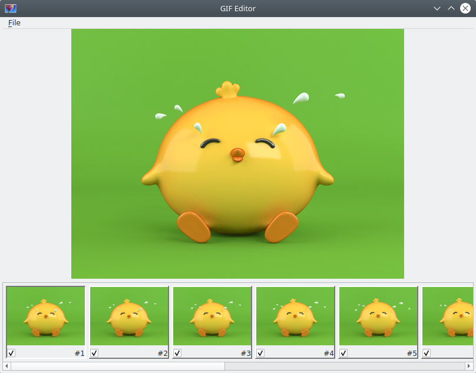

# Reading

In the UI we use `QImage`, but Magic++ works with its own `Image` class.
We need conversion method from `Magick::Image` to `QImage`. Great place for this
is in the main window private data class. We need to create an object of `View` class
and set it as a central widget of the main window, and again the place for it
is main window private data class. So let's look at it.

```cpp
class MainWindowPrivate {
public:
	MainWindowPrivate( MainWindow * parent )
		:	m_view( new View( parent ) )
		,	q( parent )
	{
	}

	//! Clear view.
	void clearView();
	//! Convert Magick::Image to QImage.
	QImage convert( const Magick::Image & img );

	//! Current file name.
	QString m_currentGif;
	//! Frames.
	std::vector< Magick::Image > m_frames;
	//! View.
	View * m_view;
	//! Parent.
	MainWindow * q;
}; // class MainWindowPrivate
```

We will work in the future with a sequence of `Magick::Image` objects for editing,
so we have a data member for it. When GIf opened and we want to open a new one
we should clear the current view, so let's look at the `clearView()` method.

```cpp
void
MainWindowPrivate::clearView()
{
	m_frames.clear();
	m_view->tape()->clear();
	m_view->currentFrame()->setImage( QImage() );
}
```

No comments.

Conversion from `Magick::Image` to `QImage` is simple as well.

```cpp
QImage
MainWindowPrivate::convert( const Magick::Image & img )
{
    QImage qimg( static_cast< int > ( img.columns() ),
		static_cast< int > ( img.rows() ), QImage::Format_RGB888 );
    const Magick::PixelPacket * pixels;
    Magick::ColorRGB rgb;

    for( int y = 0; y < qimg.height(); ++y)
	{
        pixels = img.getConstPixels( 0, y, static_cast< std::size_t > ( qimg.width() ), 1 );

        for( int x = 0; x < qimg.width(); ++x )
		{
            rgb = ( *( pixels + x ) );

            qimg.setPixel( x, y, QColor( static_cast< int> ( 255 * rgb.red() ),
				static_cast< int > ( 255 * rgb.green() ),
				static_cast< int > ( 255 * rgb.blue() ) ).rgb());
        }
    }

	return qimg;
}
```

Ok. We have empty `openGif()` slot in the `MainWindow` class. And to open GIF we should
implement it.

```cpp
void
MainWindow::openGif()
{
	const auto fileName = QFileDialog::getOpenFileName( this,
		tr( "Open GIF..." ), QString(), tr( "GIF (*.gif)" ) );

	if( !fileName.isEmpty() )
	{
		d->clearView();

		try {
			std::vector< Magick::Image > frames;

			Magick::readImages( &frames, fileName.toStdString() );

			Magick::coalesceImages( &d->m_frames, frames.begin(), frames.end() );

			std::for_each( d->m_frames.cbegin(), d->m_frames.cend(),
				[this] ( const Magick::Image & img )
				{
					this->d->m_view->tape()->addFrame( this->d->convert( img ) );
				} );

			if( !d->m_frames.empty() )
				d->m_view->tape()->setCurrentFrame( 1 );
		}
		catch( const Magick::Exception & x )
		{
			d->clearView();

			QMessageBox::warning( this, tr( "Failed to open GIF..." ),
				QString::fromLocal8Bit( x.what() ) );
		}
	}
}
```

Simple, isn't it? You can believe, you can not believe, but editor now opens
GIF images and displays all frames.



And this is less than 1K lines of code!

[Back](view.md) | [Contents](../README.md) | [Next](saving-of-removed-frames.md)