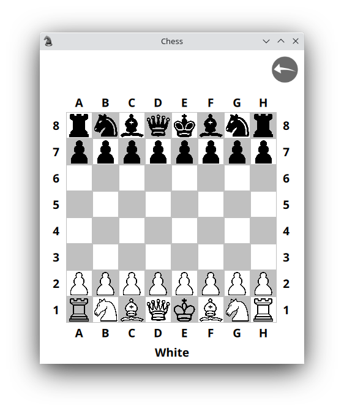

# Main window

QML application should have the main window (top widget if it's possible to say so),
it is like a main() function in C\+\+ code, entry point. Let's do it.

```qml
import QtQuick.Window 2.2
import QtQuick 2.7
import QtQuick.Controls 2.2
import ChessSignals 1.0

ApplicationWindow {
    id: appWindow
    visible: true

    property int offset: 16
    property int minSize: offset * 2 + 50 * 8

    width: minSize
    height: minSize + offset + 64

    Rectangle {
        id: rect
        anchors.fill: parent

        UndoBtn {
            id: undoBtn
            width: Math.min( Math.min( appWindow.width, appWindow.height ) / 10, 64 )
            height: width
            x: appWindow.width - width - 10
            y: 10
        }

        Board {
            id: board
            width: Math.min( parent.width,
                parent.height - offset - undoBtn.height - 10 - turn.height )
            height: Math.min( parent.width,
                parent.height - offset - undoBtn.height - 10 - turn.height )
            x: Math.abs( rect.width - width ) / 2
            y: Math.abs( rect.height - height - turn.height - undoBtn.height - 10 ) / 2 + undoBtn.height + 10

            objectName: "board"
        }

        Text {
            id: turn
            objectName: "turn"
            height: offset
            anchors.horizontalCenter: rect.horizontalCenter
            y: board.y + board.height
            font.bold: true
            font.pixelSize: 14

            text: qsTr( "White" )
        }
    }

    CheckMateDialog {
        id: checkmate

        appWindowSize: Qt.size( appWindow.width, appWindow.height )
        turnText: turn.text

        onClosed: { board.newGame() }
    }

    DrawGameDialog {
        id: drawgame

        appWindowSize: Qt.size( appWindow.width, appWindow.height )

        onClosed: { board.newGame() }
    }

    TransformDialog {
        id: transform

        appWindowSize: Qt.size( appWindow.width, appWindow.height )

        onClosed: { board.transformation( figure, color, fx, fy ) }
    }

    Connections {
        target: game

        onCheckmate: {
            checkmate.open()
        }

        onDrawgame: {
            drawgame.open()
        }

        onPawnTransformation: {
            transform.color = color
            transform.fx = fx
            transform.fy = fy

            transform.open()
        }

        onNoMoreUndo: {
            undoBtn.disable()
        }
    }
}
```

Line by line. As you can see I import my own ChessSignals type. This is needed to know on QML
side about user defined type, in our case about Signals bridge. You will understand meaning of this
line when will see the main() function from C\+\+. But let be step by step.

We implement our top window with ApplicationWindow element. I placed Rectangle in the window,
where placed undo button, the board and a label of the color of current move team.

After you can see dialogues definitions and connections.

As you can see the target for the connections is game property, this property I set in C\+\+
and this is our Signals C\+\+ object. I will show later how to start QML application and set
all context properties in the main() function in C\+\+.

Just want to add that in QML user defined items names with the name of *.qml file.
I placed Board item into Board.qml and simple use Board type in the main window.

And this looks like.



[Back](board.md) | [Contents](../README.md) | [Next](dialog.md)
